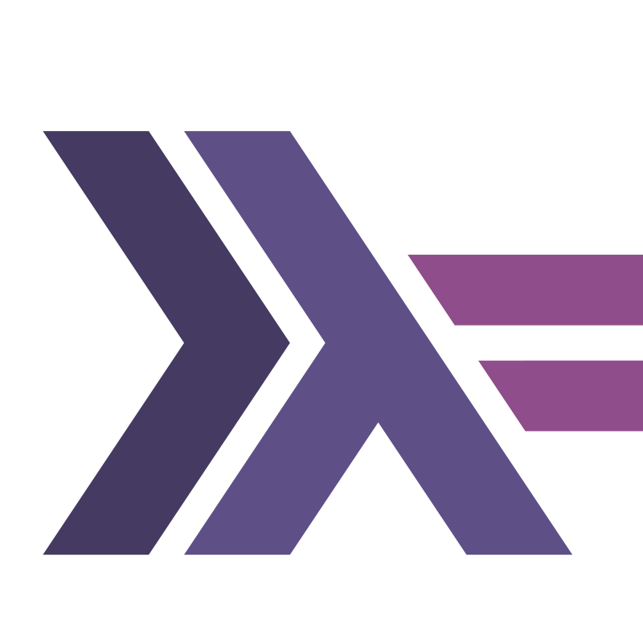

# Kovalev Dmitry
I'm a software development geek

## My projects

### [ClickHaskell](https://github.com/GetShopTV/ClickHaskell):   

ClickHouse driver for Haskell

1. Provides high level developer friendly API
2. Implements native protocol for efficient utilisation of DBMS resources 
3. Has always up to date API documentation

### [myNixOS](https://github.com/KovalevDima/myNixOS): 
My NixOS configuration flake
1. Modularized for configuring 2 hosts
2. Provides module with hyprland wayland compositor
