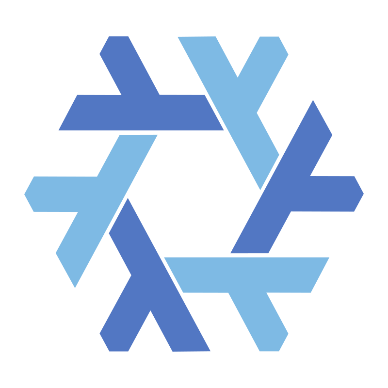

<article>

<section class="bordered" style="flex-direction: row; justify-content: space-between;">

Opensource enthusiast 
 
DM me to get 1 free consulting if you are a geek team 
(user of   )

</section>

<section class="bordered" style="flex-direction: row; justify-content: space-between;">

<h3> Send me a tip: </h3>

- 200$ upgrade lab
- 50$ hosting bill
- 5$ coffee cup

</section>

</article>

<article class="projects">

<section class="bordered">

### [ClickHaskell](https://github.com/GetShopTV/ClickHaskell):   

Implemented ClickHouse DBMS **Native protocol** and **client** in Haskell

- Compile time verification
- Low dependency footprint
- Pretty simple design
- Documentation as a code
- Nextgen CI/CD
</section>

<section class="bordered">

### [KovalevDima](https://github.com/KovalevDima/KovalevDima):  
Learned Nix/NixOS to improve personal productivity

- IaC for this page
- Reproducible configuration
- Full disk encryption
- Tiling window manager
- Bitcoin node server
</section>

</article>

<!--
<article class="projects">

<section class="bordered">

### Optimization #1

</section>

</article>
-->
